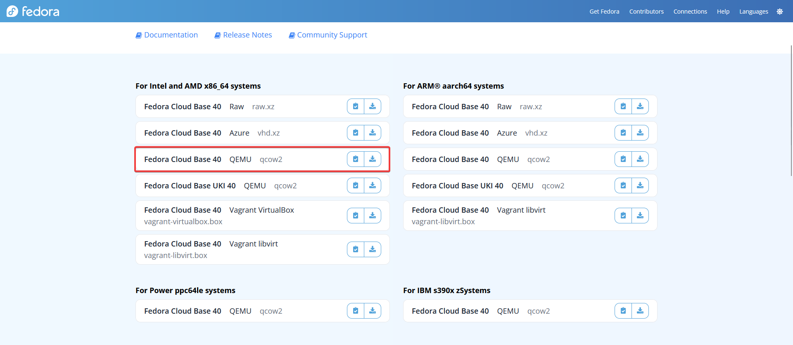

# Proxmox - Configuration image Cloud avec Cloud-init

Tags: Fedora, Proxmox
Published: 17 mai 2024
Author: https://github.com/slendymilky

## Contexte

L'objectif de ce document est de commencer sur de bonnes bases. Il vise à garder une trace de la manière dont j'ai mis à jour une image cloud d'une distribution Linux, en l'occurrence Fedora, afin de pouvoir déployer facilement des machines virtuelles (VM) sur mon cluster Proxmox.

## Préparation

L'objectif de ce document est de fournir une base solide pour le travail à venir. Il décrit la procédure suivie pour mettre à jour une image cloud de la distribution Linux Fedora, afin de permettre un déploiement simplifié de machines virtuelles (VM) sur mon cluster Proxmox.

Ce guide servira de référence pour s'assurer que chaque étape est bien documentée et pourra être reproduite facilement à l'avenir.

### Téléchargement Fedora

Donc comme expliquer, je pars sur Fedora 40

[The lightweight VM environment](https://fedoraproject.org/cloud/)

[Fedora Cloud](https://fedoraproject.org/cloud/download/)



Je vais donc prendre l’image “Fedora Cloud Base 40” au format Qcow2.

<aside>
💡 Il est aussi possible d’utiliser l’image RAW sur Proxmox, mais pour des raisons de souplesse je vais rester sur Qcow2. (Et aussi pour les snapshots)

</aside>

On télécharge sur proxmox l’image :

```bash
root@pve-hp02:~# wget https://download.fedoraproject.org/pub/fedora/linux/releases/40/Cloud/x86_64/images/Fedora-Cloud-Base-Generic.x86_64-40-1.14.qcow2

Fedora-Cloud-Base-Generic.x86_64-40-1.1 100%[=============================================================================>] 379.06M  52.0MB/s    in 8.1s    

2024-05-17 14:10:17 (47.0 MB/s) - ‘Fedora-Cloud-Base-Generic.x86_64-40-1.14.qcow2’ saved [397475840/397475840]

root@pve-hp02:~# 
```

---

### Monter l’image disque

On ajoute le paquet pour monter l’image Qcow2 :

```bash
apt update
apt install guestmount -y
```

Pour monter notre image on va d’abord créer un dossier ou monter le disque :

```bash
mkdir /mnt/guest
```

Ensuite on monte notre fichier disque :

```bash
guestmount -a ./Fedora-Cloud-Base-Generic.x86_64-40-1.14.qcow2 -i /mnt/guest/
```

<aside>
✅ Et voilà le disque est monté.

</aside>

---

## Éditer cloud.cfg

Dans cette partie nous allons profiter d’ajouter deux parties au fichier déjà existant. Vu qu’il s’agit d’une image “cloud” le fichier est déjà présent avec ce qu’il faut pour la base.

Nous allons ajouter le module `packages` et le module `runcmd`, le premier va permettre d’installer au premier boot les paquets que nous voulons, dans mon cas il s’agit des guest-agent et pour plus tard je vais ajouter d’autre paquets qui me serait utile dans le futur.

Pour `runcmd` il va s’agir de faire des commandes à chaque démarrage, cela va permettre de lancer par exemple une mise à jour des paquets puis de redémarrer afin d’être à jour le plus souvent possible.

### Modification fichier

On commence par ouvrir le fichier de config

```bash
nano /mnt/guest/etc/cloud/cloud.cfg
```

<aside>
⚠️ **Attention :** Le chemin présenté ici est à changer en conséquence de votre chemin.

</aside>

Une fois dans le fichier nous allons ajouter ces deux parties :

```yaml
# Adding package `qemu-guest-agent` to install on first boot
packages:
  - qemu-guest-agent

# Adding `dnf update -y` and `reboot` commands to run at every boot
runcmd:
  - dnf update -y
  - reboot
```

---

## Éditer la liste des repos

Bon il est vrai que dans la majorité des cas vous pouvez garder les repos par défauts, mais je suis chez [init7](https://www.init7.net/), un super opérateur suisse qui a des mirroirs pour plusieurs distribution Linux, en étant sur le réseau autant en profiter.

### Modification fichier repos actuel

Vu que je n’ai pas envie d’utiliser d’autre repo je vais tout simplement les désactiver, il suffit de mettre la valeur 0  au `enabled=0` .

### Création fichier repo init7

Dans le dossier `/etc/yum.repos.d/` on crée le fichier `init7-fedora.repo` . Une fois dedans on ajoute les lignes suivantes :

```
[init7-fedora]
name=Fedora Mirror from Init7
baseurl=https://mirror.init7.net/fedora/fedora/linux/releases/$releasever/Everything/$basearch/os
enabled=1
gpgcheck=1
gpgkey=file:///etc/pki/rpm-gpg/RPM-GPG-KEY-fedora-$releasever-$basearch
```

Voilà, comme ça j’ai le bon repo directement via init7 ! 😀

---

## Éditer le message d’avant connexion

C’est toujours bien de savoir comment modifier ce message donc voici comment :

```bash
# issue c'est pour l'affichage de la console
nano /etc/issue

# issue.net est pour l'affichage via SSH
nano /etc/issue.net
```

Ensuite évidemment on met ce que l’on veut par exemple :

```

********************************************************************************
*                                                                              *
*                             AVERTISSEMENT !!!                                *
*                                                                              *
*  Toute connexion ou utilisation non autorisée de ce système est strictement  *
*  prohibée. Les contrevenants feront face à des conséquences disciplinaires   *
*  et légales.                                                                 *
*                                                                              *
*                             ** SURVEILLANCE **                               *
*                                                                              *
*  Toutes les activités sur ce système sont surveillées et enregistrées.       *
*  En continuant, vous reconnaissez et consentez à cette surveillance.         *
*                                                                              *
*                             ** INFO **                                       *
*                                                                              *
*  \S
*  Kernel \r on an \m (\l)
*                                                                              *
********************************************************************************

```

<aside>
💡 La dernière partie est ce ce qui était présent de base

</aside>

---

## Changer le clavier utiliser

Évidemment en bon suisse que je suis j’aime mon Qwertz, donc je veux utiliser par défaut sur la vm le clavier suisse français.

Pour ça il faut modifier un simple fichier de config ici :

```bash
nano /etc/vconsole.conf
```

Une fois dedans on edit simplement la valeur `KEYMAP=` :

```bash
# Written by systemd-localed(8) or systemd-firstboot(1), read by systemd-localed
# and systemd-vconsole-setup(8). Use localectl(1) to update this file.
KEYMAP=fr_CH
```

Voilà clavier suisse “installer”.

---

## Ajouter neofetch au motd

Pour ajouter cette petite touche sympa rien de compliqué, on install neofetch évidemment et surtout on crée un fichier `motd.sh`.

```bash
nano /etc/profile.d/motd.sh
```

```bash
#!/bin/bash
printf "\n"
neofetch
printf "\n"
```

Et on oublie pas de le rendre exécutable :

```bash
chmod +x /etc/profile.d/motd.sh
```